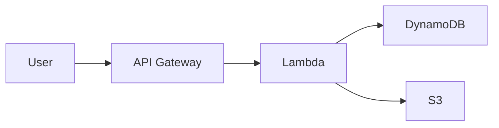

::title::
AWS Dark Theme

::subtitle::
A Professional Slidev Theme for AWS Presentations

::speaker::
Your Name (Pronouns)

Your Title

Your Company

<!--
This is the cover slide with AWS gradient background.
Use named slots for structured content.
-->

---
layout: section
---

# Section title

<!--
Section slides are great for dividing your presentation into major topics.
They feature a gradient background and large text.
-->

---
layout: intro
---

# Intro Layout

## Subtitle Goes Here

This layout is perfect for introducing new topics or sections. It provides a clean, focused presentation of your content with proper hierarchy.

Use it when you need more text than a section slide but want to maintain visual impact.

<!--
Intro layout is between section and default - more content than section, cleaner than default.
-->

---
layout: intro
class: bg-aws-dark-blue
---

# AWS Dark Blue Background

## A Professional Alternative

This slide uses `class: bg-aws-dark-blue` (#141e2c)

Perfect for a softer, more professional look than pure black while maintaining the dark theme aesthetic.

Great for corporate presentations or when you want a subtle background.

<!--
Demonstrates AWS dark blue background - a professional alternative to pure black.
-->

---
layout: default
---

# Default Layout

This is the standard content layout with:

- Clean black background
- Perfect for bullet points and text content
- Automatic footer with AWS logo and page number
- Supports all standard markdown formatting

You can add **bold text**, *italic text*, and `inline code`.

<!--
The default layout is your go-to for most content slides.
It includes automatic footer with logo and page numbers.
-->

---
layout: two-cols
---

::title::
# Two-cols layout

::left::
## Step 1: Setup
Initialize your AWS environment:

- Create AWS account
- Configure IAM policies

## Step 2: Development
Build using AWS best practices:

- Design architecture
- Implement core features

::right::
## Step 3: Testing
Test in staging environment:

- Unit testing
- Integration testing

## Step 4: Deployment
Deploy to production:

- Set up CI/CD pipeline
- Deploy infrastructure

<!--
Two-cols layout supports scrolling for longer content.
Each column scrolls independently when content exceeds page height.
-->

---
layout: left-right
---

# Left Column

Left column content:

- Feature A
- Feature B
- Feature C

Perfect for comparisons or side-by-side content.

::right::

# Right Column

Right column content:

- Benefit 1
- Benefit 2
- Benefit 3

Both columns are equal width.

<!--
Two-column layout is great for comparisons, before/after, or complementary content.
-->

---
layout: image-right
---

# Image Right Layout

::left::

Content on the left, image on the right.

- Perfect for visual storytelling
- Supports any image size
- Maintains aspect ratio
- Great for architecture diagrams

::right::


<!--
Image-right layout: title spans full width, content splits into left/right columns.
-->

---

# Inline Images

You can also use images inline within any layout:

{width=600px}

Use `{width=XXXpx}` to control image size.

<!--
Inline images work in any layout. Control size with width parameter.
-->


---
layout: default
---

# Code Highlighting

Slidev supports beautiful code highlighting:

```typescript
// TypeScript example
interface User {
  id: number;
  name: string;
  email: string;
}

const user: User = {
  id: 1,
  name: 'John Doe',
  email: 'john@example.com'
};
```

Supports many languages: TypeScript, Python, Java, Go, Rust, and more!

<!--
Code blocks are automatically highlighted with Shiki.
Great for technical presentations.
-->

---
layout: default
---

# <GradientText color="orange-pink">Gradient Text</GradientText>

Highlight important terms with <GradientText>gradient effects</GradientText>!

Available color schemes:

- <GradientText color="blue-green">Blue to Green</GradientText> (default)
- <GradientText color="blue-purple">Blue to Purple</GradientText>
- <GradientText color="orange-pink">Orange to Pink</GradientText>

Use it for <GradientText>key concepts</GradientText>, <GradientText color="blue-purple">product names</GradientText>, or <GradientText color="orange-pink">important terms</GradientText>.

<!--
GradientText component adds visual emphasis to important terms.
Choose colors that match your content.
-->

---
layout: center
---

# <GradientText color="blue-purple">Center Layout</GradientText>

Perfect for <GradientText color="blue-green">section breaks</GradientText> or <GradientText color="orange-pink">important announcements</GradientText>

Content is centered both horizontally and vertically

Use GradientText component to <GradientText color="blue-purple">emphasize key words</GradientText>

<!--
Center layout puts content in the middle with vertical and horizontal centering.
Great for transitions or key messages. Use GradientText for emphasis.
-->

---
layout: center
class: bg-ocean
---

# 🌊 Ocean Theme

**Professional • Calm • Trustworthy**

This slide uses `class: bg-ocean`

Perfect for corporate or technical presentations

<!--
Demonstrates Ocean gradient background - professional blue tones.
Simply add class: bg-ocean to any slide.
-->

---
layout: center
class: bg-sunset
---

# 🌅 Sunset Theme

**Warm • Energetic • Creative**

This slide uses `class: bg-sunset`

Great for marketing or creative presentations

<!--
Demonstrates Sunset gradient background - warm orange to pink tones.
Simply add class: bg-sunset to any slide.
-->

---
layout: center
class: bg-forest
---

# 🌲 Forest Theme

**Natural • Growth • Sustainable**

This slide uses `class: bg-forest`

Ideal for environmental or growth-focused topics

<!--
Demonstrates Forest gradient background - natural green tones.
Simply add class: bg-forest to any slide.
-->

---
layout: center
class: bg-royal
---

# 👑 Royal Theme

**Luxury • Creative • Premium**

This slide uses `class: bg-royal`

Perfect for premium products or creative showcases

<!--
Demonstrates Royal gradient background - elegant purple tones.
Simply add class: bg-royal to any slide.
-->

---
layout: center
class: bg-fire
---

# 🔥 Fire Theme

**Bold • Passionate • Dynamic**

This slide uses `class: bg-fire`

Great for high-energy or action-oriented content

<!--
Demonstrates Fire gradient background - bold red to orange tones.
Simply add class: bg-fire to any slide.
-->

---
layout: center
class: bg-tech
---

# 💻 Tech Theme

**Modern • Technical • Innovative**

This slide uses `class: bg-tech`

Perfect for technology or innovation topics

<!--
Demonstrates Tech gradient background - modern cyan to blue tones.
Simply add class: bg-tech to any slide.
-->

---
layout: default
---

# Tables

Tables are fully supported:

| Feature | AWS Theme | Default Theme |
|---------|-----------|---------------|
| Dark Mode | ✅ | ❌ |
| Gradient Backgrounds | ✅ | ❌ |
| Custom Components | ✅ | ❌ |
| AWS Branding | ✅ | ❌ |

Tables automatically style with AWS colors.

<!--
Tables work great for comparisons and structured data.
-->

---
layout: default
---

# Diagrams with Mermaid



Mermaid diagrams use white lines and boxes. Keep them simple for best visibility.

<!--
Mermaid diagrams are styled with white lines and boxes.
Remember to use scale parameter to fit content.
-->

---
layout: default
---

# Math Equations

Inline math: $E = mc^2$

Block equations:

$$
\frac{d}{dx}\left( \int_{0}^{x} f(u)\,du\right)=f(x)
$$

Powered by KaTeX for beautiful mathematical notation.

<!--
LaTeX math support is built-in for technical and scientific presentations.
-->

---
layout: default
---

# Icons

Use Iconify icons easily:

- <carbon:checkmark class="text-green-400" /> Completed tasks
- <carbon:close class="text-red-400" /> Cancelled items  
- <carbon:arrow-right class="text-blue-400" /> Next steps
- <carbon:warning class="text-yellow-400" /> Important notes

Or use emoji: 🚀 ✅ ❌ 💡 📊 🔧

<!--
Icons add visual interest. Use carbon icons or emoji for best compatibility.
-->

---
layout: default
---

# UnoCSS Utilities

Slidev includes UnoCSS for styling:

<div class="grid grid-cols-3 gap-4 mt-8">
  <div class="p-4 bg-blue-500/20 rounded">
    Box 1
  </div>
  <div class="p-4 bg-green-500/20 rounded">
    Box 2
  </div>
  <div class="p-4 bg-purple-500/20 rounded">
    Box 3
  </div>
</div>

Use utility classes for quick styling without custom CSS.

<!--
UnoCSS provides Tailwind-like utilities for rapid styling.
-->

---
layout: default
---

# Additional Resources

[AWS Documentation](https://aws.amazon.com/documentation/)

[Slidev Documentation](https://sli.dev)

[Theme Repository](#)

<!--
Final slide with links and resources using center layout.
-->

---
layout: section
---

# Theme Customization

Customize colors and gradients

<!--
Section slide demonstrating customization options.
-->

---

# Global Background Settings

## Content Slides (default, center, intro, etc.)

Default: **Pure black (#000000)**

Change globally with CSS variable:

```yaml
<style>
:root {
  --theme-background: #1a1a1a;  /* Dark gray */
}
</style>
```

## Special Slides (cover, section, end)

Default: **Gradient backgrounds**

Change globally with CSS variables:

```yaml
<style>
:root {
  --theme-gradient-cover: linear-gradient(...);
  --theme-gradient-section: linear-gradient(...);
  --theme-gradient-end: linear-gradient(...);
}
</style>
```

<!--
Explains the two types of background settings: content slides vs special slides.
-->

---

# Per-Slide Background Override

Use `class:` to override background for individual slides:

```yaml
---
layout: default
class: bg-ocean
---

# This slide uses Ocean gradient
```

```yaml
---
layout: center
class: bg-aws-dark-blue
---

# This slide uses AWS dark blue background
```

**Available classes:** `bg-ocean`, `bg-sunset`, `bg-forest`, `bg-night`, `bg-fire`, `bg-royal`, `bg-tech`, `bg-aws-blue`, `bg-aws-orange`, `bg-aws-green`, `bg-black`, `bg-dark-gray`, `bg-dark-blue`, `bg-aws-dark-blue`

<!--
Shows how to override background for individual slides using predefined classes.
-->

---
layout: two-cols
---

::title::
# Predefined Gradient Presets

::left::

## AWS Gradients

- **awsDefault**: Blue to Purple
- **awsBlue**: Dark blue to light blue
- **awsOrange**: Dark to orange
- **awsGreen**: Dark to green
- **awsPurple**: Dark blue to purple

::right::

## Theme Gradients

- **ocean**: Blue gradient 🌊
- **sunset**: Orange to pink 🌅
- **forest**: Green gradient 🌲
- **night**: Dark blue 🌙
- **fire**: Red to orange 🔥
- **royal**: Purple gradient 👑
- **tech**: Cyan to blue 💻

<!--
Lists all available gradient presets for easy selection.
-->

---

# Using Gradient Presets

Copy gradient values from `theme-aws-dark/theme.config.js`:

```css
<style>
:root {
  /* Ocean theme - professional and calm */
  --theme-gradient-cover: linear-gradient(135deg, #0a4d68 0%, #088395 50%, #05bfdb 100%);
  --theme-gradient-section: linear-gradient(135deg, #0a4d68 0%, #088395 50%, #05bfdb 100%);
  --theme-gradient-end: linear-gradient(135deg, #0a4d68 0%, #088395 50%, #05bfdb 100%);
}
</style>
```

Or mix and match different gradients:

```css
<style>
:root {
  --theme-gradient-cover: linear-gradient(135deg, #232f3e 0%, #ff9900 100%);  /* Orange */
  --theme-gradient-section: linear-gradient(135deg, #232f3e 0%, #00a1e0 100%); /* Blue */
  --theme-gradient-end: linear-gradient(135deg, #232f3e 0%, #00d4aa 100%);    /* Green */
}
</style>
```

<!--
Demonstrates how to apply gradient presets to your presentation.
-->

---

# Other Customization Options

You can also customize:

**Typography:**
- `--theme-font-size-h1`: Main title size (default: 3rem)
- `--theme-font-size-h2`: Section title size (default: 2rem)
- `--theme-font-size-p`: Paragraph text size (default: 1.125rem)

**Colors:**
- `--aws-blue`, `--aws-orange`, `--aws-green`: Brand colors
- `--theme-text`: Main text color (default: #ffffff)

**Spacing:**
- `--theme-padding`: Slide padding (default: 2.5rem 3rem 1.5rem 3rem)
- `--theme-gap`: Column gap (default: 3rem)

See `theme-aws-dark/CUSTOMIZATION.md` for complete guide.

<!--
Overview of other customization options available in the theme.
-->

---
layout: end
---

# Thank You !

Questions?

<!--
End layout provides a clean conclusion to your presentation.
-->